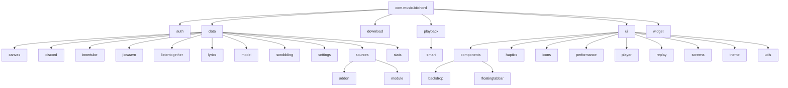
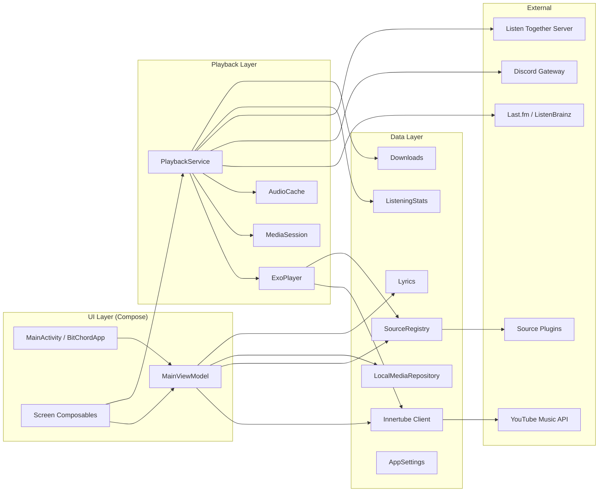
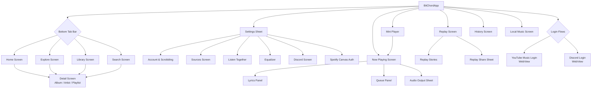
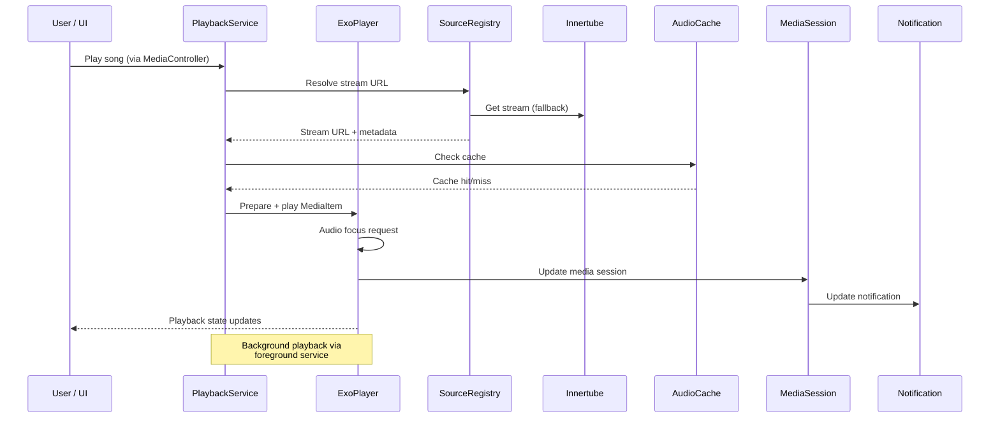
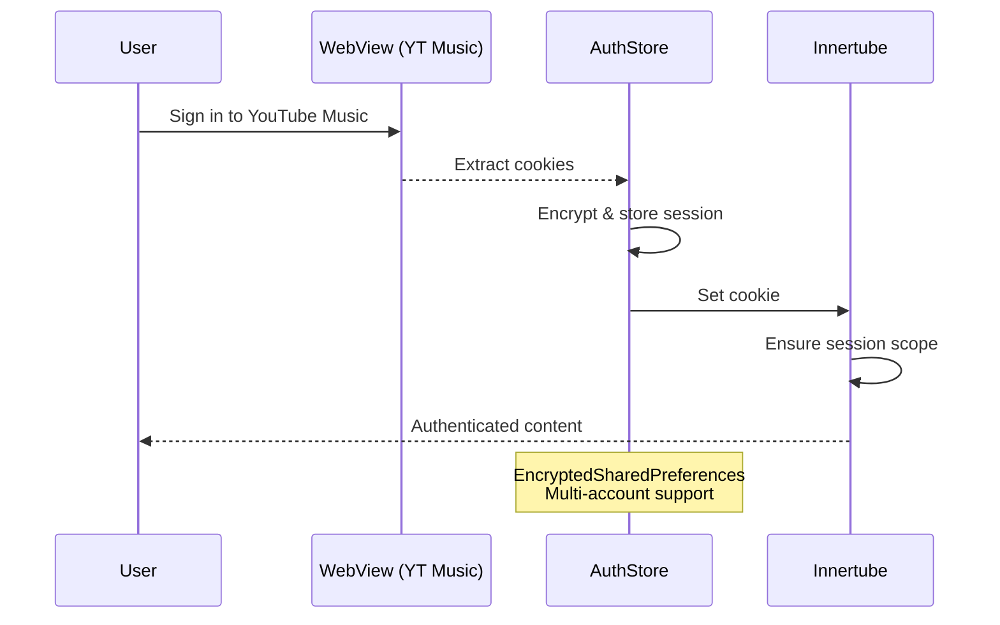
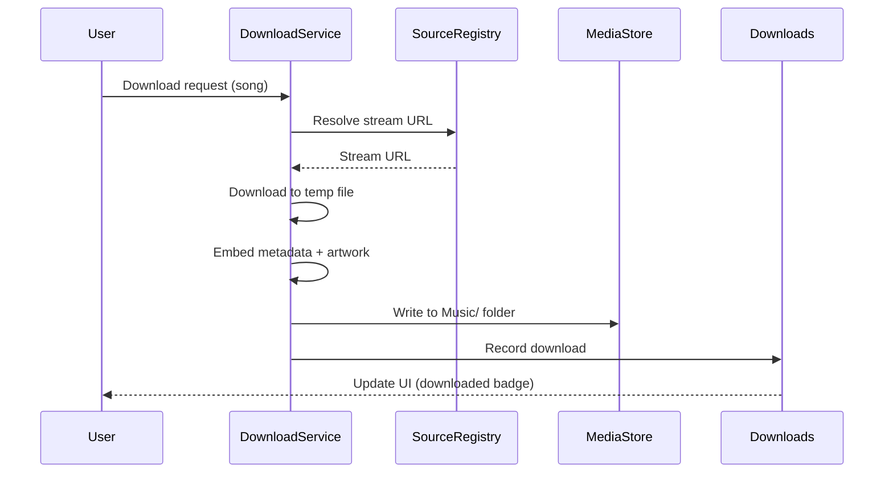
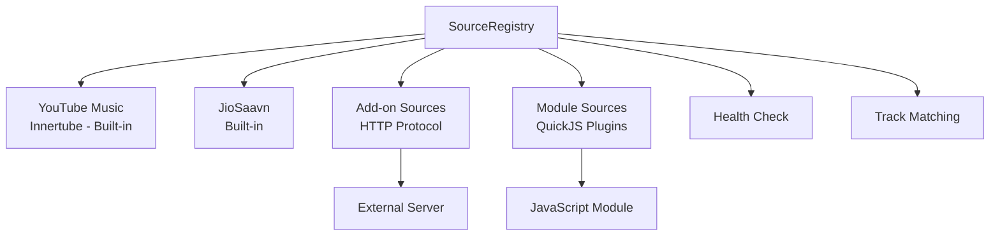
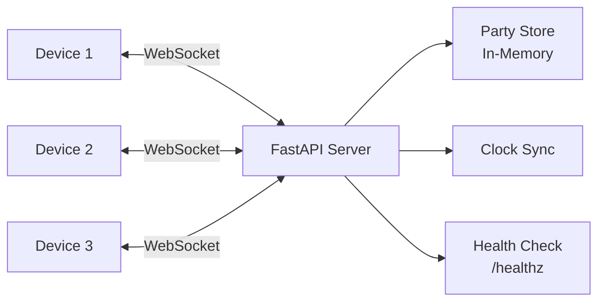
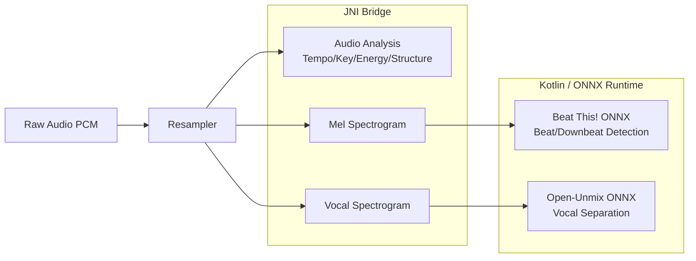

# FloroBeat — Architecture Documentation

> **Based on:** BitChord v1.6 (versionCode 17)
> **Document Date:** 2026-09-21
> **Maintained by:** FloroSoft Engineering

---

## 1. Module Structure

FloroBeat is a **single-module Android application** with an external Python backend and shared native C++ sources.

```
FloroBeat/
├── :app                    # Android application (single Gradle module)
├── backend/                # Listen Together party server (not a Gradle module)
└── native/                 # Shared C++ analysis code (built via CMake from :app)
```

There are no multi-module Gradle splits. All Kotlin source lives under `app/src/main/java/com/music/bitchord/`.

---

## 2. Major Packages



### Package Responsibilities

| Package | Purpose |
|---|---|
| **`auth`** | Google account authentication (WebView-based OAuth), Discord login, encrypted session storage |
| **`data.canvas`** | Spotify Canvas animated artwork fetching and caching |
| **`data.discord`** | Discord Rich Presence gateway connection |
| **`data.innertube`** | YouTube Music (Innertube) API client — search, browse, playback, auth |
| **`data.jiosaavn`** | JioSaavn music service integration |
| **`data.listentogether`** | Multi-device synchronised listening (WebSocket client) |
| **`data.lyrics`** | Multi-source lyrics fetching (synced, plain, translations) |
| **`data.model`** | Core data models: Song, Album, Artist, Playlist, SearchResult, etc. |
| **`data.scrobbling`** | Last.fm and ListenBrainz scrobbling |
| **`data.settings`** | AppSettings (Jetpack DataStore), audio quality, theme, preferences |
| **`data.sources`** | Pluggable music source system (registry, health, config) |
| **`data.sources.addon`** | HTTP-based external add-on source protocol |
| **`data.sources.module`** | QuickJS JavaScript module source plugins |
| **`data.stats`** | On-device listening statistics, artist facts, Replay/Wrapped feature |
| **`download`** | Track download service, queue, metadata embedding, progress tracking |
| **`playback`** | Media3 player, PlaybackService, queue, caching, audio focus, media session |
| **`playback.smart`** | Automix: beat analysis via JNI + ONNX, tempo stretching, DJ transitions |
| **`ui.components`** | Shared composables: MiniPlayer, SearchField, SongActionsSheet, TopBar, etc. |
| **`ui.components.backdrop`** | Custom glass/blur system with runtime shaders |
| **`ui.components.floatingtabbar`** | Animated bottom navigation bar |
| **`ui.haptics`** | Haptic feedback utilities |
| **`ui.icons`** | Custom icon set (BitChordIcons → FloroBeatIcons) |
| **`ui.performance`** | Display refresh rate management |
| **`ui.player`** | Now Playing screen, mesh gradient, lyrics display, audio output picker |
| **`ui.replay`** | Year-in-review feature (Spotify Wrapped-style) |
| **`ui.screens`** | All main screens: Home, Explore, Library, Search, Settings, Detail, etc. |
| **`ui.theme`** | Material 3 theme, typography, artwork-driven dynamic colors |
| **`ui.utils`** | iOS-style overscroll effect |
| **`widget`** | Android home screen widgets (square + wide, with transport controls) |

---

## 3. Data Flow



---

## 4. UI Flow



---

## 5. Playback Flow



### Key Playback Components

- **PlaybackService** extends `MediaLibraryService` — runs as foreground service with `mediaPlayback` type
- **ExoPlayer** with OkHttp data source for network streaming
- **Media3 Session** provides system-wide media controls, Android Auto, lock screen
- **AudioCache** — disk LRU cache for streamed audio
- **QueueBuilder** — constructs and manages the playback queue
- **QueueShuffle** — maintains shuffle state independently from queue order
- **AutoPlay** — loads continuation tracks from YouTube Music radio
- **Crossfade** — gapless crossfade (0–12s configurable)
- **Smart/Automix** — DJ-style transitions using beat detection (JNI + ONNX Runtime)

---

## 6. Authentication Flow



- **AuthStore** — manages multiple Google accounts with encrypted storage
- **WebView-based** — no OAuth client ID needed; captures cookies from YouTube Music sign-in
- **Multi-profile** — supports YouTube Music channel/brand account switching
- **Session restoration** — restores on app launch from `BitChordApplication`

---

## 7. Download Flow



- **DownloadService** — foreground service (`dataSync` type)
- Downloads to `Music/BitChord` folder (→ `Music/FloroBeat`)
- Embeds metadata tags and artwork into downloaded files
- Tracks what's downloaded via `Downloads` singleton

---

## 8. Lyrics Flow

- Multi-source lyrics with configurable priority
- Sources include: YouTube Music (Innertube), PaxSenix, and others
- Word-synced highlighting (syllable-level)
- Translation support
- Lyrics offset adjustment
- Falls back through sources until one provides lyrics

---

## 9. Source System



- **SourceRegistry** manages all available sources
- **YouTube Music (Innertube)** is the primary and fallback source
- **Add-on sources** communicate via HTTP protocol (tested via MockWebServer in unit tests)
- **Module sources** run JavaScript in QuickJS VM for custom resolution logic
- Sources provide: stream URLs, quality tiers, metadata
- Health checks validate source availability
- Track matching resolves content across sources

---

## 10. Backend Architecture

### Listen Together Server (`backend/`)



- **FastAPI** + WebSockets (uvicorn)
- **No database** — all party state in-memory
- **Clock synchronisation** via ping/pong with offset calculation
- **Party features:** 6-character codes, up to 5 devices, any member controls
- **Deployment:** Render free tier, single instance (parties are per-instance)
- **Key config (env vars):** `JAM_MAX_MEMBERS`, `JAM_STATE_HEARTBEAT_MS`, `JAM_PLAY_LEAD_MS`, `JAM_DISCONNECT_GRACE_MS`

---

## 11. Native Components

### Audio Analyzer Pipeline



- **C++17** compiled via CMake 3.22.1
- **ABIs:** armeabi-v7a, arm64-v8a, x86_64
- **Library name:** `bitchord_analysis`
- **JNI classes:** `TrackFeatures`, `MelSpectrogram`, `VocalSpectrogram` (in `playback.smart` package)
- **ONNX models:** `beat_this_int8.onnx` (4.5MB), `vocals_umxhq_int8.onnx` (9MB)

---

## 12. Database & Caching

| Store | Technology | Purpose |
|---|---|---|
| **AppSettings** | Jetpack DataStore | All user preferences, theme, quality, etc. |
| **AuthStore** | EncryptedSharedPreferences | Encrypted auth sessions, cookies, profiles |
| **Widget state** | SharedPreferences (`bitchord_widget`) | Widget playback snapshot |
| **AudioCache** | DiskLruCache (custom) | Cached audio streams |
| **CanvasCache** | DiskLruCache (custom) | Cached canvas video clips |
| **Image cache** | Coil DiskCache (100MB) | Album artwork |
| **ListeningStats** | File-based | Listening history for Replay |
| **Downloads record** | File-based | What's been downloaded |
| **SearchHistory** | DataStore/Preferences | Recent searches |
| **LastPlayed** | DataStore/Preferences | Playback resume state |
| **SourceRegistry** | DataStore/Preferences | Source configurations |

> **Note:** There is NO Room database. All persistence uses DataStore, SharedPreferences, or file-based storage.

---

## 13. Background Services

| Service | Type | Purpose |
|---|---|---|
| **PlaybackService** | Foreground (mediaPlayback) | Music playback, media session, notification |
| **DownloadService** | Foreground (dataSync) | Track downloading |
| **AppLocalesMetadataHolderService** | Disabled by default | AndroidX per-app locale storage |

---

## 14. Localization

The app supports **15 locales** plus the default (English):
- German (de), Spanish (es), French (fr), Hebrew (he), Hindi (hi)
- Indonesian (id), Italian (it), Japanese (ja), Polish (pl)
- Portuguese (pt), Russian (ru), Thai (th), Turkish (tr)
- Vietnamese (vi), Chinese (zh)

Plus resource qualifiers:
- `values-night` — dark theme colors
- `values-v31` — API 31+ specific values
- `values-sw600dp` — tablet layout values
